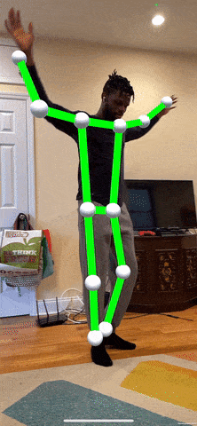

# MoveNet 3D Sample

Sample project showing 3D pose detection in augmented reality with NatML and ARFoundation in Unity Engine.

## Requirements
- Unity 2020.3+

## Supported Platforms
- Android API level 24+
- iOS 13+
- macOS 10.15+
- Windows 10 (64-bit)

## Resources
- Join the [NatML community on Discord](https://hub.natml.ai/community).
- See the [NatML documentation](https://docs.natml.ai/unity).
- Check out [NatML on GitHub](https://github.com/natmlx).
- Read the [NatML blog](https://blog.natml.ai/).
- Discuss [NatML on Unity Forums](https://forum.unity.com/threads/open-beta-natml-machine-learning-runtime.1109339/).
- Contact us at [hi@natml.ai](mailto:hi@natml.ai).

Thank you very much!